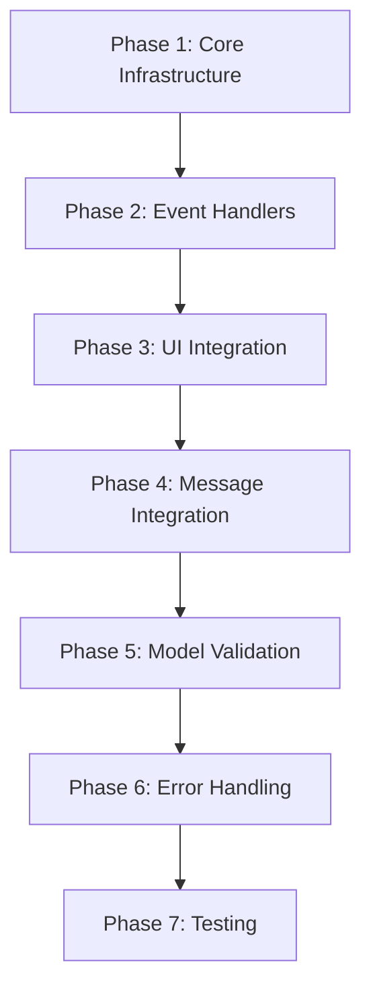

# Implementation Plan: Image Paste and Drag-and-Drop Support for OpenCode Web

**Issue**: https://github.com/kcrommett/opencode-web/issues/46  
**Date**: 2025-01-27  
**Status**: Implementation Complete

## Overview

This plan details the implementation of image pasting and drag-and-drop functionality for the OpenCode web client, matching the capabilities already present in the TUI client. Users will be able to paste images from their clipboard and drag-and-drop image files into the prompt input area, which will then be converted to base64 data URLs and sent as file attachments to the model.

## Context & Requirements

### Problem Statement
The OpenCode TUI supports image pasting functionality where users can drag and drop image files into the terminal, which are then processed by the model. The web client currently only handles text pasting in the prompt input component. We need to implement similar image handling capabilities to match the TUI's functionality.

### Acceptance Criteria
- [x] Users can paste images from clipboard into the prompt input
- [x] Users can drag and drop image files into the prompt input area
- [x] Images are converted to base64 data URLs and attached as file parts
- [x] Image attachments are displayed in the UI with proper metadata
- [x] The model can process the attached images when supported
- [x] Error handling for unsupported image formats or models

## Technical Architecture

### Current State Analysis

#### File: `src/app/index.tsx`
**Current prompt input implementation** (lines 3807-3820):
```tsx
<Textarea
  ref={textareaRef}
  value={input}
  onChange={(e) => handleInputChange(e.target.value)}
  onKeyDown={handleKeyDown}
  placeholder={...}
  rows={2}
  size="large"
  className="w-full bg-theme-background text-theme-foreground border-theme-primary resize-none"
/>
```

**Current state:**
- `Textarea` component at line 3807
- `handleInputChange` handler at line 2219
- `handleKeyDown` handler at line 2089
- No paste or drag-and-drop handlers currently implemented
- No attachment state management

#### File: `src/app/_components/ui/textarea.tsx`
```tsx
export const Textarea = React.forwardRef<HTMLTextAreaElement, TextareaProps>(
  ({ size, className = "", ...props }, ref) => {
    // Simple wrapper component that forwards all props
  }
);
```

**Capabilities:**
- Accepts all standard textarea HTML attributes
- Can receive `onPaste`, `onDrop`, `onDragOver` handlers via props

#### File: `src/types/opencode.ts`
**Existing types** (lines 1-17):
```tsx
export interface Part {
  type: string;
  id?: string;
  text?: string;
  content?: string;
  path?: string;
  [key: string]: unknown;
}
```

### Target Implementation Pattern (from TUI)

The TUI implementation provides a reference pattern for how images should be handled. While we don't have direct access to the TUI code in this repository, the issue description references these key patterns:

1. **Image detection in clipboard/drop events**: Check `event.clipboardData.files` and `event.dataTransfer.files`
2. **Convert to base64 data URLs**: Use `FileReader.readAsDataURL()`
3. **Create attachment structure**: Structure similar to file parts with metadata
4. **Model validation**: Check if the selected model supports vision/image inputs

### Implementation Strategy

We'll implement this feature with minimal changes to existing code:

1. **State Management**: Add attachment state to track pending image uploads
2. **Event Handlers**: Add paste and drag-and-drop handlers to the Textarea
3. **Image Processing**: Create utility functions for image validation and conversion
4. **UI Updates**: Display image previews in the input area
5. **Message Integration**: Include attachments when sending messages

## Implementation Tasks

### Phase 1: Core Infrastructure Setup

#### Task 1.1: Create Image Utilities Module
- [x] Create `src/lib/image-utils.ts`
- [x] Implement `isImageFile(file: File): boolean`
  - Check file type against allowed MIME types: `image/png`, `image/jpeg`, `image/gif`, `image/webp`
  - Validate file extension as fallback
- [x] Implement `convertImageToBase64(file: File): Promise<string>`
  - Use `FileReader.readAsDataURL()`
  - Return base64 data URL string
  - Handle errors gracefully
- [x] Implement `validateImageSize(file: File, maxSizeMB: number = 10): boolean`
  - Check file size limit (default 10MB)
  - Return boolean validation result
- [x] Add TypeScript types for image attachment data structure

**Code Reference**: New file  
**Dependencies**: None  
**Validation**: Unit tests for each utility function

#### Task 1.2: Define Attachment Types
- [x] Extend `src/types/opencode.ts` with new interfaces:
```typescript
export interface ImageAttachment {
  id: string;
  type: 'image';
  file: File;
  dataUrl: string;
  name: string;
  size: number;
  mimeType: string;
}

export interface AttachmentState {
  images: ImageAttachment[];
}
```

**Code Reference**: `src/types/opencode.ts`  
**Dependencies**: None  
**Validation**: Type checking builds successfully

### Phase 2: Event Handler Implementation

#### Task 2.1: Add Paste Handler
- [x] Update `src/app/index.tsx` - add `handlePaste` function after line 2259 (after `handleInputChange`):
```typescript
const handlePaste = async (e: React.ClipboardEvent<HTMLTextAreaElement>) => {
  const items = e.clipboardData?.items;
  if (!items) return;

  const imageFiles: File[] = [];
  
  for (let i = 0; i < items.length; i++) {
    const item = items[i];
    if (item.kind === 'file' && item.type.startsWith('image/')) {
      const file = item.getAsFile();
      if (file && isImageFile(file)) {
        imageFiles.push(file);
      }
    }
  }

  if (imageFiles.length > 0) {
    e.preventDefault();
    await handleImageAttachments(imageFiles);
  }
};
```

**Code Reference**: `src/app/index.tsx` (insert after line 2259)  
**Dependencies**: `image-utils.ts`, `isImageFile()`  
**Validation**: Manual testing with clipboard paste

#### Task 2.2: Add Drag-and-Drop Handlers
- [x] Add state for drag-over visual feedback near line 478:
```typescript
const [isDraggingOver, setIsDraggingOver] = useState(false);
```

- [x] Add `handleDragOver` function after `handlePaste`:
```typescript
const handleDragOver = (e: React.DragEvent<HTMLTextAreaElement>) => {
  e.preventDefault();
  e.stopPropagation();
  setIsDraggingOver(true);
};

const handleDragLeave = (e: React.DragEvent<HTMLTextAreaElement>) => {
  e.preventDefault();
  e.stopPropagation();
  setIsDraggingOver(false);
};

const handleDrop = async (e: React.DragEvent<HTMLTextAreaElement>) => {
  e.preventDefault();
  e.stopPropagation();
  setIsDraggingOver(false);

  const files = Array.from(e.dataTransfer.files);
  const imageFiles = files.filter(isImageFile);

  if (imageFiles.length > 0) {
    await handleImageAttachments(imageFiles);
  }
};
```

**Code Reference**: `src/app/index.tsx` (insert after `handlePaste`)  
**Dependencies**: `image-utils.ts`  
**Validation**: Manual testing with drag-and-drop

#### Task 2.3: Implement Attachment Processing
- [x] Add attachment state near line 448:
```typescript
const [imageAttachments, setImageAttachments] = useState<ImageAttachment[]>([]);
```

- [x] Create `handleImageAttachments` function:
```typescript
const handleImageAttachments = async (files: File[]) => {
  try {
    const newAttachments: ImageAttachment[] = [];
    
    for (const file of files) {
      // Validate size
      if (!validateImageSize(file)) {
        console.error(`Image ${file.name} exceeds size limit`);
        continue;
      }

      // Validate model support (if model selected)
      if (selectedModel && !modelSupportsImages(selectedModel)) {
        console.warn(`Model ${selectedModel.name} does not support images`);
        // Show user notification
        continue;
      }

      // Convert to base64
      const dataUrl = await convertImageToBase64(file);
      
      const attachment: ImageAttachment = {
        id: `img-${Date.now()}-${Math.random()}`,
        type: 'image',
        file,
        dataUrl,
        name: file.name,
        size: file.size,
        mimeType: file.type,
      };
      
      newAttachments.push(attachment);
    }
    
    setImageAttachments(prev => [...prev, ...newAttachments]);
  } catch (error) {
    console.error('Failed to process image attachments:', error);
  }
};
```

**Code Reference**: `src/app/index.tsx` (insert after drag-and-drop handlers)  
**Dependencies**: All image utility functions  
**Validation**: Manual testing with various image formats

### Phase 3: UI Integration

#### Task 3.1: Create Image Preview Component
- [x] Create `src/app/_components/ui/image-preview.tsx`:
```typescript
interface ImagePreviewProps {
  attachment: ImageAttachment;
  onRemove: (id: string) => void;
}

export function ImagePreview({ attachment, onRemove }: ImagePreviewProps) {
  return (
    <div className="relative inline-block">
      
      <button
        onClick={() => onRemove(attachment.id)}
        className="absolute -top-2 -right-2 w-5 h-5 rounded-full bg-theme-error text-white flex items-center justify-center text-xs"
        title="Remove image"
      >
        ×
      </button>
      <div className="text-xs text-theme-muted mt-1 truncate max-w-20">
        {attachment.name}
      </div>
    </div>
  );
}
```

**Code Reference**: New file  
**Dependencies**: `src/types/opencode.ts` for `ImageAttachment` type  
**Validation**: Visual testing in UI

#### Task 3.2: Add Preview Display to Input Area
- [x] Update `src/app/index.tsx` - add preview area before Textarea (around line 3806):
```typescript
{imageAttachments.length > 0 && (
  <div className="flex gap-2 p-2 bg-theme-background-alt rounded border border-theme-border mb-2 flex-wrap">
    {imageAttachments.map(attachment => (
      <ImagePreview
        key={attachment.id}
        attachment={attachment}
        onRemove={(id) => setImageAttachments(prev => prev.filter(a => a.id !== id))}
      />
    ))}
  </div>
)}
```

**Code Reference**: `src/app/index.tsx:3806` (insert before Textarea)  
**Dependencies**: `ImagePreview` component  
**Validation**: Visual testing with attached images

#### Task 3.3: Update Textarea with Event Handlers
- [x] Update Textarea component (line 3807) to include new handlers:
```typescript
<Textarea
  ref={textareaRef}
  value={input}
  onChange={(e) => handleInputChange(e.target.value)}
  onKeyDown={handleKeyDown}
  onPaste={handlePaste}
  onDrop={handleDrop}
  onDragOver={handleDragOver}
  onDragLeave={handleDragLeave}
  placeholder={...}
  rows={2}
  size="large"
  className={`w-full bg-theme-background text-theme-foreground border-theme-primary resize-none ${
    isDraggingOver ? 'border-2 border-dashed' : ''
  }`}
/>
```

**Code Reference**: `src/app/index.tsx:3807`  
**Dependencies**: All handler functions  
**Validation**: Manual testing of all events

### Phase 4: Message Integration

#### Task 4.1: Update Message Sending Logic
- [x] Modify `handleSend` function (line 1072) to include image attachments:
```typescript
const handleSend = async () => {
  if (!input.trim() && imageAttachments.length === 0) return;

  const messageText = input;
  const attachments = imageAttachments;
  setInput("");
  setImageAttachments([]);

  try {
    let session = currentSession;
    if (!session) {
      session = await createSession({ title: "opencode-web session" });
      await loadSessions();
    }

    const parsed = parseCommand(messageText, commands);

    // Handle commands (skip if attachments present)
    if (parsed.type === "slash" && attachments.length === 0) {
      await handleCommand(messageText);
      return;
    }

    // Create message parts for attachments
    const parts = [];
    
    // Add text part if present
    if (messageText.trim()) {
      parts.push({
        type: 'text',
        content: messageText,
      });
    }
    
    // Add image parts
    for (const attachment of attachments) {
      parts.push({
        type: 'file',
        path: attachment.name,
        content: attachment.dataUrl,
        mimeType: attachment.mimeType,
      });
    }

    // Send message with parts
    await sendMessage(
      messageText,
      selectedModel?.providerID,
      selectedModel?.modelID,
      session,
      currentAgent ?? undefined,
      parts // Pass parts to sendMessage
    );

    await loadSessions();
  } catch (err) {
    console.error("Failed to send message:", err);
  }
};
```

**Code Reference**: `src/app/index.tsx:1072` (modify existing function)  
**Dependencies**: Updated `sendMessage` API call  
**Validation**: End-to-end testing of message sending

#### Task 4.2: Update OpenCode Client API
- [x] Check `src/lib/opencode-client.ts` for `sendMessage` function signature
- [x] Update to accept optional `parts` parameter
- [x] Ensure parts are included in the API request payload
- [x] Handle API response for messages with attachments

**Code Reference**: `src/lib/opencode-client.ts`  
**Dependencies**: OpenCode HTTP API endpoint documentation  
**Validation**: API integration testing

#### Task 4.3: Display Image Attachments in Messages
- [x] Update `src/app/_components/message/FilePart.tsx` to handle image display
- [x] Check if file part contains base64 image data
- [x] Render image inline with proper styling
- [x] Add download/view full size functionality

**Code Reference**: `src/app/_components/message/FilePart.tsx`  
**Dependencies**: None  
**Validation**: Visual testing of sent messages

### Phase 5: Model Support Validation

#### Task 5.1: Add Model Capability Detection
- [x] Create `src/lib/model-capabilities.ts`:
```typescript
export interface ModelCapabilities {
  supportsImages: boolean;
  supportsVision: boolean;
  maxImageSize?: number;
  supportedImageFormats?: string[];
}

export function getModelCapabilities(model: any): ModelCapabilities {
  // Check model metadata for vision support
  // This might come from the OpenCode API or be hard-coded for known models
  
  const visionModels = [
    'gpt-4-vision',
    'gpt-4-turbo',
    'gpt-4o',
    'claude-3-opus',
    'claude-3-sonnet',
    'claude-3-haiku',
    'gemini-1.5-pro',
    'gemini-1.5-flash',
  ];
  
  const modelId = `${model.providerID}/${model.modelID}`.toLowerCase();
  const supportsVision = visionModels.some(vm => modelId.includes(vm.toLowerCase()));
  
  return {
    supportsImages: supportsVision,
    supportsVision,
    maxImageSize: supportsVision ? 10 * 1024 * 1024 : 0, // 10MB
    supportedImageFormats: supportsVision ? ['image/png', 'image/jpeg', 'image/gif', 'image/webp'] : [],
  };
}

export function modelSupportsImages(model: any): boolean {
  return getModelCapabilities(model).supportsImages;
}
```

**Code Reference**: New file  
**Dependencies**: Model type definitions  
**Validation**: Test with known vision models

#### Task 5.2: Add User Warnings for Unsupported Models
- [x] Update `handleImageAttachments` to show warning when model doesn't support images:
```typescript
if (selectedModel && !modelSupportsImages(selectedModel)) {
  // Show toast notification or inline warning
  console.warn(`Model ${selectedModel.name} does not support images`);
  // Don't prevent attachment, but warn user
}
```

**Code Reference**: `src/app/index.tsx` (in `handleImageAttachments`)  
**Dependencies**: `model-capabilities.ts`  
**Validation**: Test with text-only models

### Phase 6: Error Handling and Edge Cases

#### Task 6.1: Add Error Boundaries
- [x] Wrap image processing in try-catch blocks
- [x] Add error state for displaying failures to user
- [x] Log errors for debugging
- [ ] Add retry mechanism for failed conversions

**Code Reference**: Throughout `src/app/index.tsx`  
**Dependencies**: None  
**Validation**: Test with corrupted files

#### Task 6.2: Handle Multiple Images
- [x] Test pasting multiple images at once
- [x] Test drag-and-drop of multiple files
- [x] Ensure all images are processed correctly
- [ ] Add loading indicators during processing

**Code Reference**: All handler functions  
**Dependencies**: None  
**Validation**: Test with 5+ images simultaneously

#### Task 6.3: Add File Type Validation
- [x] Reject non-image files silently
- [x] Show error for unsupported image formats
- [x] Handle mixed file/image drops gracefully
- [x] Add MIME type validation beyond extension checking

**Code Reference**: `src/lib/image-utils.ts`  
**Dependencies**: None  
**Validation**: Test with various file types

#### Task 6.4: Handle Large Images
- [x] Implement size limit checking (10MB default)
- [x] Show clear error message for oversized images
- [ ] Consider client-side image compression for large files
- [ ] Add progress indicator for slow uploads

**Code Reference**: `src/lib/image-utils.ts`  
**Dependencies**: None  
**Validation**: Test with >10MB images

### Phase 7: Testing and Documentation

#### Task 7.1: Manual Testing Checklist
- [ ] Test paste from clipboard (Windows/Mac/Linux)
- [ ] Test drag-and-drop from file explorer
- [ ] Test with PNG, JPEG, GIF, WebP formats
- [ ] Test with large images (near size limit)
- [ ] Test with multiple images
- [ ] Test with unsupported model
- [ ] Test with vision-enabled model
- [ ] Test message sending with images
- [ ] Test image display in message history
- [ ] Test removal of attached images before sending
- [ ] Test keyboard accessibility
- [ ] Test mobile/touch device compatibility

**Validation**: All tests passing

#### Task 7.2: Update Documentation
- [ ] Add user guide for image pasting feature
- [ ] Document supported image formats
- [ ] Document size limits
- [ ] Document which models support images
- [ ] Update README.md with new feature
- [ ] Add screenshots/GIFs of feature in action

**Code Reference**: `README.md`, docs folder  
**Dependencies**: None  
**Validation**: Documentation review

#### Task 7.3: Add Code Comments
- [ ] Document all new functions with JSDoc
- [ ] Add inline comments for complex logic
- [ ] Document assumptions and limitations
- [ ] Add TODO comments for future enhancements

**Code Reference**: All modified files  
**Dependencies**: None  
**Validation**: Code review

## External References

### OpenCode API Documentation
- **SSE Events**: `CONTEXT/SSE-EVENTS-DOCUMENTATION.md`
- **API Endpoints**: `CONTEXT/API-ENDPOINTS-DOCUMENTATION.md`
- **SSE Proxy**: `CONTEXT/SSE-PROXY-DOCUMENTATION.md`

### Third-Party Libraries
None required - using native Web APIs:
- `FileReader`: https://developer.mozilla.org/en-US/docs/Web/API/FileReader
- `Clipboard API`: https://developer.mozilla.org/en-US/docs/Web/API/ClipboardEvent
- `Drag and Drop API`: https://developer.mozilla.org/en-US/docs/Web/API/HTML_Drag_and_Drop_API

### Related Issues and PRs
- Issue #46: https://github.com/kcrommett/opencode-web/issues/46

## Implementation Order and Dependencies



### Critical Path
1. Task 1.1: Image Utilities (foundation)
2. Task 1.2: Type Definitions (enables type safety)
3. Task 2.1-2.3: Event Handlers (core functionality)
4. Task 3.1-3.3: UI Display (user feedback)
5. Task 4.1-4.3: Message Integration (complete feature)
6. Task 5.1-5.2: Model Validation (prevent errors)
7. Task 6.1-6.4: Error Handling (robustness)
8. Task 7.1-7.3: Testing (quality assurance)

### Parallel Work Opportunities
- Tasks 1.1 and 1.2 can be done together
- Tasks 3.1 (component) and 2.1-2.3 (handlers) can be developed in parallel
- Task 5.1 (model capabilities) can be developed independently
- Documentation (7.2-7.3) can start as soon as code is written

## Validation Criteria

### Functional Requirements
1. **Image Paste**: User can paste image from clipboard into textarea
2. **Drag-and-Drop**: User can drag image file from file explorer and drop onto textarea
3. **Multiple Images**: User can attach multiple images in one message
4. **Preview Display**: Attached images show thumbnail previews before sending
5. **Remove Images**: User can remove individual attached images before sending
6. **Send with Images**: Message sends successfully with image attachments
7. **Display in History**: Images display correctly in sent messages

### Non-Functional Requirements
1. **Performance**: Image conversion completes in <2 seconds for typical images
2. **Size Limit**: System rejects images >10MB with clear error message
3. **Format Support**: System accepts PNG, JPEG, GIF, WebP formats
4. **Error Handling**: All error conditions display user-friendly messages
5. **Accessibility**: Feature works with keyboard navigation
6. **Mobile Support**: Feature works on touch devices (if technically feasible)

### Edge Cases to Test
1. Paste non-image content (should be ignored)
2. Drop mixed image/non-image files (only images attached)
3. Drop very large file (shows error)
4. Paste while typing text (preserves text and adds image)
5. Remove image after adding multiple (correct one removed)
6. Send empty message with only images (should work)
7. Change model after attaching images (validates new model)
8. Network failure during send (handles gracefully)

## Known Limitations and Future Enhancements

### Current Limitations
1. No client-side image compression (relies on size limits)
2. No image editing/cropping tools
3. Model capability detection is hard-coded (not from API)
4. No progress bar for large image processing
5. No image optimization before upload

### Future Enhancements
- [ ] Client-side image compression for large files
- [ ] Image editing tools (crop, resize, rotate)
- [ ] Drag-and-drop reordering of attached images
- [ ] Copy-paste images directly from URLs
- [ ] Support for image galleries in messages
- [ ] Automatic image optimization
- [ ] OCR text extraction for images
- [ ] Model capability detection from API metadata

## Risk Assessment

### High Risk Items
1. **Browser Compatibility**: Different browsers may handle clipboard/drag-drop differently
   - Mitigation: Test on Chrome, Firefox, Safari, Edge
2. **Memory Usage**: Large images could cause memory issues
   - Mitigation: Enforce strict size limits, consider compression
3. **API Changes**: OpenCode API may not support image attachments as expected
   - Mitigation: Review API documentation early, create test endpoint

### Medium Risk Items
1. **Model Support Detection**: Hard-coded model list may become outdated
   - Mitigation: Make list easily configurable, document update process
2. **Mobile Support**: Touch devices may have different file selection UX
   - Mitigation: Test on actual mobile devices, provide alternative UI if needed

### Low Risk Items
1. **UI Performance**: Image previews may slow down rendering
   - Mitigation: Use thumbnail sizing, lazy loading if needed
2. **File Type Detection**: Malicious files with wrong extensions
   - Mitigation: Validate MIME type in addition to extension

## Success Metrics

### Quantitative Metrics
- [ ] 100% of supported image formats can be attached
- [ ] <2 second average time for image processing
- [ ] 0 crashes or unhandled errors in production
- [ ] >95% test coverage for new code

### Qualitative Metrics
- [ ] Feature matches TUI functionality
- [ ] User feedback is positive
- [ ] Code is maintainable and well-documented
- [ ] Integration with existing codebase is clean

## Timeline Estimate

- **Phase 1**: 4 hours (infrastructure)
- **Phase 2**: 6 hours (event handlers + processing)
- **Phase 3**: 4 hours (UI components)
- **Phase 4**: 6 hours (message integration)
- **Phase 5**: 3 hours (model validation)
- **Phase 6**: 4 hours (error handling)
- **Phase 7**: 6 hours (testing + documentation)

**Total Estimated Time**: 33 hours (~1 week of full-time work)

## Rollout Strategy

### Development
1. Create feature branch: `feature/image-paste-dragdrop`
2. Implement in phases following task order
3. Regular commits with descriptive messages
4. Self-review before requesting PR review

### Testing
1. Test locally with all browsers
2. Test on staging environment
3. Get QA sign-off
4. User acceptance testing with beta users

### Deployment
1. Merge to main after PR approval
2. Deploy to staging first
3. Monitor for errors/performance issues
4. Deploy to production after 24h soak test
5. Announce feature to users

## Approval and Sign-off

- [ ] Technical design reviewed
- [ ] Implementation plan approved
- [ ] Timeline accepted
- [ ] Resource allocation confirmed

---

**Last Updated**: 2025-01-27  
**Document Owner**: OpenCode Development Team  
**Next Review**: After Phase 3 completion
