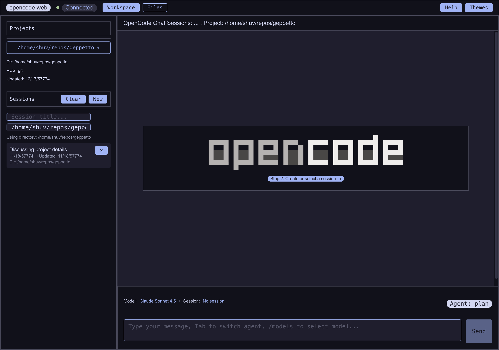

> **Note:** This is an independent, community-maintained project created by fans of OpenCode. We are not affiliated with SST Corp. or the official OpenCode project. For the official OpenCode CLI, visit [opencode.ai](https://opencode.ai).

<p align="center">
  <a href="https://opencode.ai">
    <picture>
      <source srcset="assets/logo-ornate-dark.svg" media="(prefers-color-scheme: dark)">
      <source srcset="assets/logo-ornate-light.svg" media="(prefers-color-scheme: light)">
      
    </picture>
  </a>
<br>
(web)
</p>
<p align="center">The web interface for OpenCode.</p>
<p align="center">
  <a href="https://www.npmjs.com/package/opencode-web"></a>
  <a href="https://github.com/kcrommett/opencode-web/actions/workflows/release.yml"></a>
</p>
OpenCode Web is a web-based interface for the OpenCode Server API, providing a browser-based way to interact with OpenCode sessions. Built on TanStack Start, React, and Bun, it offers a complete web experience for managing and monitoring OpenCode workflows.


## 🚀 Quick Start

### Option 1: Run with bunx (Recommended)
```bash
bunx opencode-web@latest
```

### Option 2: Install Globally
```bash
# Using Bun
bun add -g opencode-web
opencode-web

# Using npm
npm install -g opencode-web
opencode-web

# Using yarn
yarn global add opencode-web
opencode-web
```

### Option 3: One-liner Installer
```bash
curl -sSL https://raw.githubusercontent.com/kcrommett/opencode-web/main/install.sh | bash
```

Once started, open **http://localhost:3000** in your browser. The CLI launches a local OpenCode Server through the OpenCode SDK by default and wires its URL into the web client automatically. Use the command-line flags to connect to an existing server or adjust the listening host/port without touching environment variables.

#### Command-line Options
- `--external-server <url>` – connect to an existing OpenCode Server and skip the bundled instance.
- `--no-bundled-server` – skip launching the bundled server (requires `--external-server` or `VITE_OPENCODE_SERVER_URL`).
- `-p, --port <number>` – port for the web UI (default: 3000).
- `-H, --host <hostname>` – interface to bind the web UI server to (default: 127.0.0.1). Use `0.0.0.0` for LAN access.
- `-h, --help` – show the built-in usage help.

#### Environment Variables (optional)
- `PORT`: Web server port (default: 3000)
- `HOST`: Web server host/interface (default: 127.0.0.1)
- `VITE_OPENCODE_SERVER_URL`: Use an existing OpenCode Server instead of the bundled one
- `OPENCODE_WEB_DISABLE_BUNDLED_SERVER`: Set to `1`, `true`, `yes`, or `on` to skip launching the bundled server
- `OPENCODE_SERVER_PORT`: Port for the bundled OpenCode Server (default: 4096)
- `OPENCODE_SERVER_HOSTNAME`: Hostname for the bundled OpenCode Server (default: 127.0.0.1)

Example: `opencode-web --external-server https://opencode.example.com --host 0.0.0.0 -p 8080`

## Why a web interface?
- Access OpenCode sessions from any browser without additional software installation
- Real-time monitoring of active sessions with live updates
- Browser-native features like screenshots, downloads, and responsive design
- Ideal for demonstrations, training, and remote collaboration

## Feature Highlights

### Session continuation anywhere
Reconnect to an existing conversation with full command history, agent context, and pending tasks so you can pick up work between devices.  


### Live session timeline
Follow model outputs, reasoning traces, and tool runs via Server-Sent Events so you always know what the agent is doing—even from your phone.  


### Multi-agent command deck
Switch between saved agent presets, route complex tasks to specialists, and keep context switching frictionless from the browser.  


### Model + command palette
Quick access to different AI models with an intuitive picker interface


### File-aware problem solving
Browse project trees, view files, and download artifacts directly from the web interface. Syntax highlighting keeps context rich.  


### Inline asset preview
Quickly view images and animations in your browser, or download other binary files.


### Theme gallery for every setup
Toggle between opencode color palettes to match whatever theme you prefer.  
  
  


### One-tap PWA install
Progressive Web App hooks keep the client a tap away with full-screen, app-like usage—ideal for tablets or a second monitor.  


## Architecture at a Glance
- **TanStack Start + React Router** power hybrid SSR/CSR routing with file-based conventions.
- **Bun server (`server.ts`)** proxies event streams to the OpenCode backend and serves the compiled client.
- **Shared lib layer** (`src/lib/`) wraps the OpenCode HTTP API for seamless integration.
- **Composable UI primitives** in `src/app/_components/ui/` provide a consistent design system.

## Requirements
- Bun 1.3.x (toolchain pinned in `bunfig.toml`)
- Node.js 18+ for editor integrations and lint tooling
- OpenCode Server (the CLI bundles one automatically; pass `--external-server` to reuse an existing instance)

## Getting Started

1. **Install dependencies**
   ```bash
   bun install
   ```
2. **Configure environment**  
   The CLI launches its own OpenCode Server in production. For local development you can still point the client at a different instance by either creating `.env.local` or starting the CLI with `--external-server`:
   ```bash
   VITE_OPENCODE_SERVER_URL=http://localhost:4096
   ```
3. **Run the dev server**
   ```bash
   bun run dev
   ```
   The app listens on [http://localhost:3000](http://localhost:3000). Replace `localhost` with a LAN IP to check in from another device on the same network.

## Production Build & Serve

1. **Build the client + SSR bundles**
   ```bash
   bun run build
   ```
   Compiled assets land in `dist/client` (static) and `dist/server` (SSR handler).
2. **Serve the production bundle**
   ```bash
   bun run start
   ```
   The `start` script executes `server.ts`, which:
   - Loads the TanStack Start handler from `dist/server/server.js`
   - Serves static assets from `dist/client`
   - Proxies `/api/events` to your OpenCode server for SSE streaming

Set `PORT`, `VITE_OPENCODE_SERVER_URL`, or `NODE_ENV` to customize runtime behavior.

## Project Structure
```
src/
├── app/                        # TanStack Start routes & UI components
│   └── _components/            # Message renderers, UI primitives, dialogs, pickers
├── contexts/                   # React contexts for session + theme state
├── hooks/                      # Reusable hooks around OpenCode data flows
├── lib/                        # HTTP client, command parser, theme helpers
├── router.tsx                  # Router configuration
server.ts                       # Bun production server wrapper
vite.config.ts                  # Vite + TanStack Start configuration
```

Key entry points include:
- `src/lib/opencode-server-fns.ts` – server-side wrappers for the OpenCode HTTP API
- `src/app/_components/message/` – renders reasoning, snapshots, tool output, and patches
- `src/app/_components/ui/` – button, dialog, picker, and form controls

## Helpful Commands
- `bun run dev` – launch the development server with hot reload
- `bun run build` – produce production-ready client + SSR bundles
- `bun run start` – serve the compiled build via the Bun runtime
- `bun run lint` – enforce shared ESLint rules
- `bun x tsc --noEmit` – typecheck without generating artifacts
- `bun run test` – run Playwright smoke tests when present

## Development Notes
- Silence logs in production by guarding with `if (process.env.NODE_ENV !== "production")`.
- Favor Bun utilities (e.g., `Bun.file`) in shared helpers when they simplify IO or streaming.
- Keep server function schemas synced with the OpenCode SDK.
- Confirm UI changes in both desktop and mobile breakpoints.

## Contributing
Follow the shared contributor handbook in `AGENTS.md`. Before opening a PR, run lint + typecheck, describe UI-visible changes, and flag any server-function updates.

---

**Join our community** [Discord](https://discord.gg/opencode) | [X.com](https://x.com/opencode)
